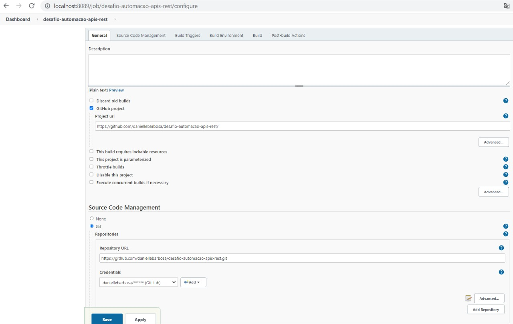
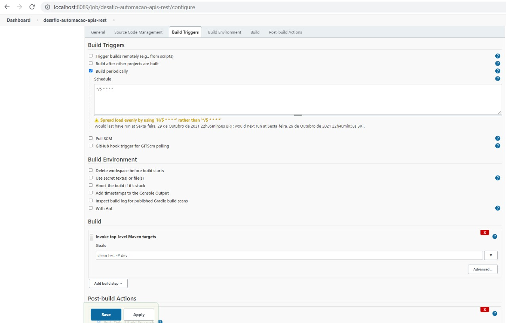
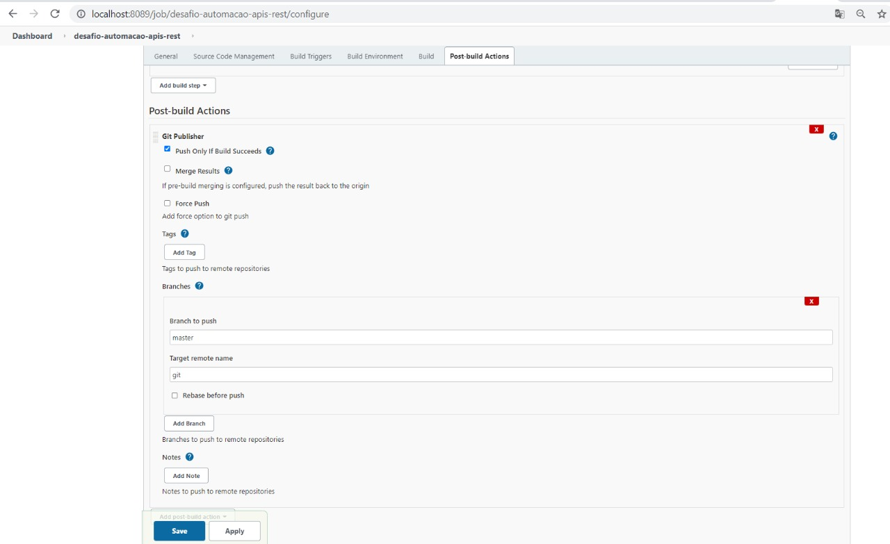
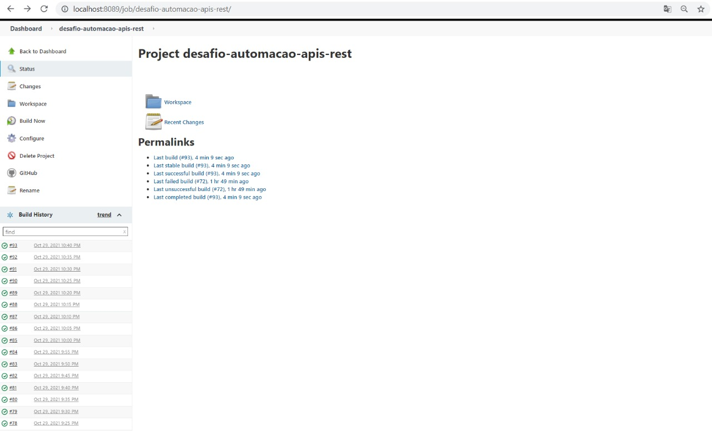

# Desafio-automacao-apis-rest

Esse projeto foi criado usando as linguagens Java, Rest Assured, Testng e Maven
A automação foi criada para testar a API do https://imgur.com/ (https://apidocs.imgur.com/) 

# Instalação
Para conseguir executar os testes eu recomendo instalar o java, uma IDE de sua preferência, e o postman.

Para o build utilize o maven.

mvn clean test -P dev/hml (ambientes de teste)

# Data-Driven

Está sendo utilizado para gerar a massa de testes do cenário AccountTests->getAccountExists, consumindo da planilha "dataDrivenFinal.xlsx".

# Relatório

O relatório está sendo gerado automaticamente após a execução, e pode ser acessado pelo caminho: desafio-automacao-apis-rest\ExtentReports\index.html.

# Threads 

Os testes estão sendo divididos em seis threads dentro do ambiente de dev, quantidade que pode ser alterada no pom.xml.

# PostgreSQL

Esta armazenando os bodys requests e os tokens de autenticação. 

# Jenkins

O Jenkins está sendo usado para o agendamento das execuções dos testes, que estão rodando a cada 5 minutos, ele é local e pode ser visto nos seguintes prints:

